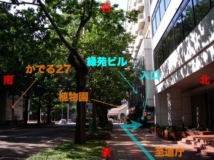

- [公式ページ](http://www.do-johodai.ac.jp/guidance/sapporosatellite.php)
- 住所: 〒060−0003 北海道札幌市中央区北３条西７丁目１−１ 緑苑ビル４階 (緑苑ビル入り口は南側)
- 交通: ＪＲ「札幌」駅、地下鉄「さっぽろ」駅より徒歩10分　/　地下鉄「大通り」駅より徒歩15分

## 道庁側(東側)から見たビル入り口前(南側)の外観

## 付近の地図

<iframe width="425" height="350" frameborder="0" scrolling="no" marginheight="0" marginwidth="0" src="http://maps.google.com/maps/ms?ie=UTF8&amp;hl=en&amp;msa=0&amp;msid=108452895591124960953.00043c908f341c4ee9b70&amp;ll=43.063733,141.345347&amp;spn=0,0&amp;om=1&amp;output=embed&amp;s=AARTsJrAiqU3RU5_bcCmCrGoyu9_ZX7dkg"></iframe> <small><a href="http://maps.google.com/maps/ms?ie=UTF8&amp;hl=en&amp;msa=0&amp;msid=108452895591124960953.00043c908f341c4ee9b70&amp;ll=43.063733,141.345347&amp;spn=0,0&amp;om=1&amp;source=embed" style="color:#0000FF;text-align:left">View Larger Map</a></small>
